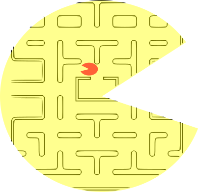

<!---  --->


# Extended Environments

Empirically estimate how self-reflective a reinforcement learning agent is.
This proof-of-concept library contains 25 so-called "extended environments"
and infrastructure allowing you to run a reinforcement learning agent against
those environments. Figuring out these environments seems to require that an
agent self-reflect about itself (see Theory below), therefore an agent's
performance in these environments can serve as a rough empirical estimate of
how self-reflective the agent is.

**Note:** As this library is first-of-kind, we have made no attempt to
optimize it. It is meant to serve more as a proof-of-concept. Rather than
strenuously optimize the environments in the library, we have instead
designed environments of theoretical interest. Measurements obtained from
this library should not be used to make real-world policy-decisions related
to self-reflection. Self-reflection should not be confused with consciousness
(the two might be related, but that is beyond the scope of this library).


## Theory

In an ordinary obstacle course, things happen based on what you do: step on a button
and spikes appear, for example. Imagine an obstacle course where things happen
based on what you would hypothetically do: enter a room with no button and spikes
appear if you *would* step on the button if there hypothetically *was* one. Such an
environment would be impossible to stage for a human participant, because it is
impossible to determine what a human would hypothetically do in some counterfactual
scenario. But if we have the source-code of an AI participant, then we **can**
determine what that participant would do in hypothetical scenarios, and so we
**can** put AI participants into such obstacle courses.

An *extended environment* is a reinforcement learning environment which is aware of
the source-code of whatever agent is interacting with it. This enables the
environment to simulate the agent and use the results when it determines which
rewards and observations to send to the agent. Although this is a departure from
traditional RL environments (which are not able to simulate agents), nevertheless,
a traditional RL agent does not require any extension in order to interact with an
Extended Environment. Thus, Extended Environments can be used to benchmark RL agents
in ways that traditional RL environments cannot.

If an agent does not self-reflect about its own actions, then an extended
environment might be difficult for the agent to figure out. Therefore, our thesis is that self-reflection is needed for an agent to achieve good performance on average over a battery of suitably chosen extended environments. This would imply that by measuring how an agent performs across such a battery of environments, it is possible to empirically estimate how
self-reflective an agent is. 

## Installation

**Note:** The library has been built and tested using Python 3.6, so we recommend using that version or later for running the library.

### Install using pip

Just like all other python packages, we recommend installing ExtendedEnvironments in a virtualenv or a conda environment.

To install, `cd` into the cloned repository and do a local pip install:
```
cd ExtendedEnvironments
pip install -e .
```

Optionally, if you wish to use the Stable Baselines3 agents in
`extended_rl/agents/SBL3_agents.py` (required for running the experiment in the
`extended_rl/experiments` directory) you will additionally need to install
Stable Baselines3:
```
pip install stable-baselines3
```

### Documentation

See `example.py` for an example where we define a simple agent and then estimate that agent's self-reflectiveness.

#### selfrefl_measure

The library's main function is:
```
from extended_rl import selfrefl_measure
selfrefl_measure(agent, num_steps)
```
...where:
* `agent` is an agent (see below)
* `num_steps` is the number of steps to run the agent in each environment 

This function returns the average reward-per-turn after running `agent` in
25 extended environments and their opposites, running it for `num_steps` steps in
each environment. (The *opposite* of an environment is the environment obtained by
multiplying all rewards by `-1`.)

For finer-grain details about the average reward-per-turn on each environment,
call `selfrefl_benchmark` instead (it has the same signature as `selfrefl_measure`
but returns a dictionary telling what average reward-per-turn the agent achieved
on each environment).

#### Agents

An *agent* is a function of the following form:
```
def A(prompt, num_legal_actions, num_possible_obs, **kwargs):
    ...
    return action
```
...where:
* `num_legal_actions` is the number of actions the agent may take
* `num_possible_obs` is the number of observations possible in the environment
* `prompt` is a tuple of one of the following two forms:
    * (The initial percept) `reward_0`, `observation_0`
    * `reward_0`, `observation_0`, `action_0`, ..., `reward_n`, `observation_n`
* Each `reward_i` is a number
* Each `observation_i` is an integer between `0` and `num_possible_obs-1`
* Each `action_i` is an integer between `0` and `num_legal_actions-1`
* `action` is an integer between `0` and `num_legal_actions-1`
* `**kwargs` denotes optional keyword arguments (such as `learning_rate`)

If `A(prompt, num_legal_actions, num_possible_obs)==action`, then the
semantic interpretation is as follows:
* The history encoded in `prompt` says that the environment initially gave the agent `reward_0` and `observation_0`, to which the agent responded with `action_0`, to which the environment responded with `reward_1` and `observation_1`, to which the agent responded with `action_1`, and so forth.
* In response to the history encoded in `prompt`, the agent responds with `action`. 

For example, here is the code for an agent who plays randomly, except that it always takes
action `0` in response to reward `0` or observation `0`:
```
def example_agent(prompt, num_legal_actions, num_possible_obs, **kwargs):
    last_reward, last_obs = prompt[-2:]
    return 0 if (last_reward==0 or last_obs==0) else random.randrange(num_legal_actions)
```

See Section 2.1 of "Extending Environments To Measure Self-Reflection In Reinforcement
Learning" for instructions on how practical RL agents can be converted into this abstract
form.

#### Environments

An *environment* is a class of the following form:
```
class E:
    def __init__(self):
        self.num_legal_actions = M
        self.num_possible_obs = N

    def react(self, T, play):
        ...
        return (reward, obs)
```
...where:
* `M` and `N` are positive integers
* `T` is an agent
* `play` is a tuple of one of the following two forms:
    * The empty tuple
    * `reward_0`, `observation_0`, `action_0`, ..., `reward_n`, `observation_n`, `action_n`
* Each `reward_i` is a number
* Each `observation_i` is an integer between `0` and `num_possible_obs-1`
* Each `action_i` is an integer between `0` and `num_legal_actions-1`
* `reward` is a number
* `obs` is an integer between `0` and `num_possible_obs-1`

If `E().react(T, play)==(reward, obs)` then the semantic interpretation is as follows:
* The history recorded in `play` states whether the environment initially gave `reward_0` and `observation_0`, in response to which the agent took `action_0`, in response to which the environment gave `reward_1` and `observation_1`, in response to which the agent took `action_1`, and so forth.
* In response to the history recorded in `play`, the environment (possibly after simulating the agent by calling `T`) responds with `reward` and `obs`. 

**Note:** When calling `T` within `E().react(T, play)`, it is only necessary to pass the
`prompt` argument to `T`. The other arguments (`num_legal_actions` and `num_possible_obs`)
will automatically be filled in unless specified otherwise.

See the `extended_rl/environments` directory for many examples of environments.

