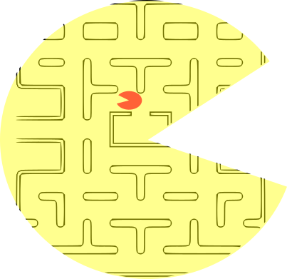

# Extended Environments

Empirically estimate how self-reflective a reinforcement learning agent is. This proof-of-concept library contains 25 so-called "extended environments" and infrastructure allowing you to run a reinforcement learning agent against those environments. Performing well on average across the space of all extended environments seems to require that an agent self-reflect about itself (see Theory below), therefore it should be possible to empirically estimate an agent's self-reflection ability by running it across a suite of benchmark extended environments such as those in this library.

**Note:** As this library is first-of-kind, we have made no attempt to optimize it. It is meant to serve more as a proof-of-concept. Rather than strenuously optimize the environments in the library, we have instead designed environments of theoretical interest. Measurements obtained from this library should not be used to make real-world policy-decisions related to self-reflection.


## Theory

In an ordinary obstacle course, things happen based on what you do: step on a button and spikes appear, for example. Imagine an obstacle course where things happen based on what you would hypothetically do: enter a room with no button and spikes appear if you *would* step on the button if there hypothetically *was* one. Such an environment would be impossible to stage for a human participant, because it is impossible to determine what a human would hypothetically do in some counterfactual scenario. But if we have the source-code of an AI participant, then we **can** determine what that participant would do in hypothetical scenarios, and so we **can** put AI participants into such obstacle courses.

An *extended environment* is a reinforcement learning environment which is able to simulate the agent and use the results when it determines which rewards and observations to send to the agent. Although this is a departure from traditional RL environments (which are not able to simulate agents), nevertheless, a traditional RL agent does not require any extension in order to interact with an Extended Environment. Thus, Extended Environments can be used to benchmark RL agents in ways that traditional RL environments cannot.

If an agent does not self-reflect about its own actions, then an extended environment might be difficult for the agent to figure out. Therefore, our thesis is that self-reflection is needed for an agent to achieve good performance on average over the space of all extended environments. This would imply that by measuring how an agent performs across a battery of such environments, it is possible to empirically estimate how self-reflective an agent is. 

## Installation

**Note:** The library has been built and tested using Python 3.6, so we recommend using that version or later for running the library.

### Install using pip

Just like all other python packages, we recommend installing ExtendedEnvironments in a virtualenv or a conda environment.

To install, `cd` into the cloned repository and do a local pip install:
```
cd ExtendedEnvironments
pip install -e .
```

Optionally, if you wish to replicate the experiments in our paper, see `extended_rl/experiments/InstallingExperimentPrerequisites.txt` for how to install Stable Baselines3 (needed for the DQN/A2C/PPO agents measured in our paper).

### Documentation

See `example.py` for an example where we define a simple agent-class and then estimate that the self-reflectiveness of instances of that class.

#### selfrefl_measure

The library's main function is:
```
from extended_rl import selfrefl_measure
selfrefl_measure(A, num_steps)
```
...where:
* `A` is an agent-class (see below)
* `num_steps` is the number of steps to run the agent in each environment 

This function returns the average reward-per-turn after running instances of `A` in 25 extended environments and their opposites, running it for `num_steps` steps in each environment. (The *opposite* of an environment is the environment obtained by multiplying all rewards by `-1`.)

For finer-grain details about the average reward-per-turn on each environment, call `selfrefl_benchmark` instead (it has the same signature as `selfrefl_measure` but returns a dictionary telling what average reward-per-turn are achieved in each environment).

#### Agents

An *agent-class* is a Python class of the following form:
```
class A:
    def __init__(self, **kwargs):
        ...

    def act(self, obs):
        ...
        return action

    def train(self, o_prev, a, r, o_next):
        ...
```
...where, for the `act` method:
* The intuition is that the method tells how the agent will act in response to a given observation.
* `obs` is an observation (a natural number below `self.n_obs`)
* (`self.n_obs` will be set automatically when instances of `A` are placed in environments)
* `action` is an action (a natural number below `self.n_actions`)
* (`self.n_actions` will be set automatically when instances of `A` are placed in environments)
...and, for the `train` method:
* The intuition is that the agent has taken action `a` in response to observation `o_prev`, received reward `r` for doing so, and this has caused the new observation to be `o_next`; and the agent is to modify itself accordingly.
* `o_prev` and `o_next` are observations (natural numbers below `self.n_obs`)
* `a` is an action (a natural number below `self.n_actions`)
* `r` is a reward (a number)

For example, here is an agent-class whose agent instances act randomly unless the current observation equals the previous observation, in which case they take action 0.
```
import random

class ExampleAgent:
    def __init__(self):
        self.prev_obs = 0

    def act(self, obs):
        if self.prev_obs == obs:
            return 0
        else:
            return random.randrange(self.n_actions)

    def train(self, o_prev, a, r, o_next):
        self.prev_obs = o_prev
```

#### Environments

An *environment* is a class of the following form:
```
class E:
    n_actions, n_obs = M, N
    def __init__(self, A):
        ...

    def start(self):
        ...
        return obs

    def step(self, action):
        ...
        return (reward, obs)
```
...where:
* `M` is a positive integer representing how many actions an agent may choose from
* `N` is a positive integer representing how many observations are possible
* `A` is an agent-class which can be used to instantiate copies of the agent, which copies can be used to simulate the agent in order to inspect the agent's behavior in hypothetical circumstances
* `obs` is an observation (a natural number below `self.n_obs`)
* `action` is an action (a natural number below `self.n_actions`)
* `reward` is a reward (a number)

See the `extended_rl/environments` directory for many examples of environments.

